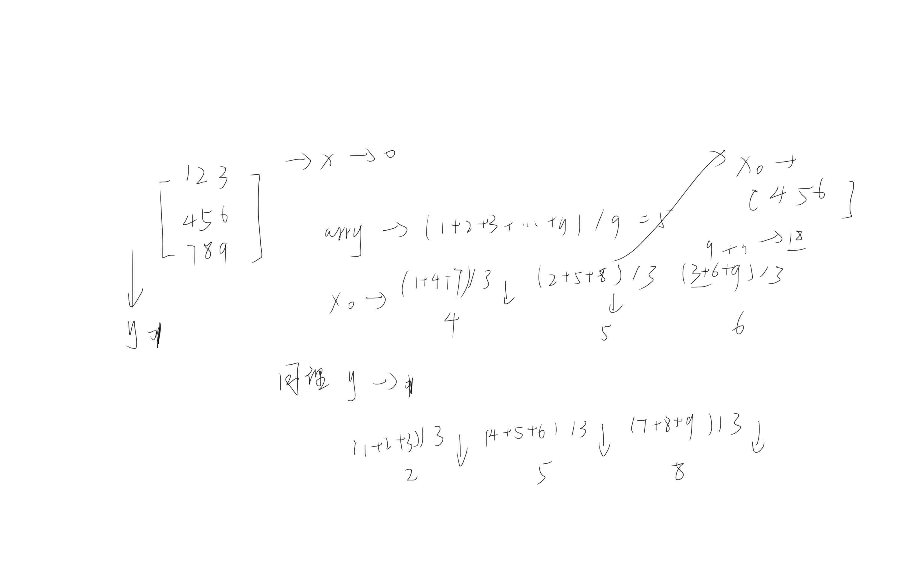
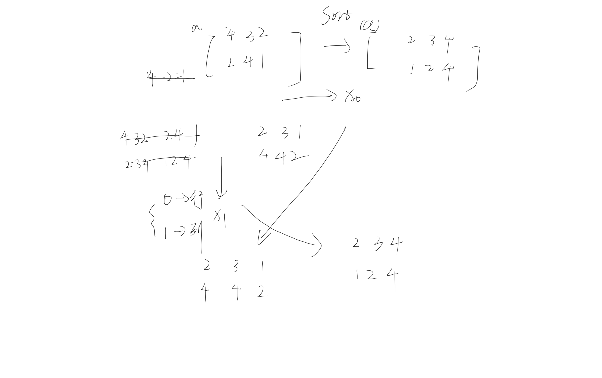

axis =0 || acxis =1
## 验证方向问题

## 创建矩阵

[createArray](./createArray.py)

## 结构矩阵

[structArray](./structArray.py)

## 分析

[statistics.py](./statistics.py)

## 算数运算

[arithmetic.py](./arithmetic.py)

## 求百分比

[statistics](./statistics.py)

## 排序

[statistics](./statistics.py)
