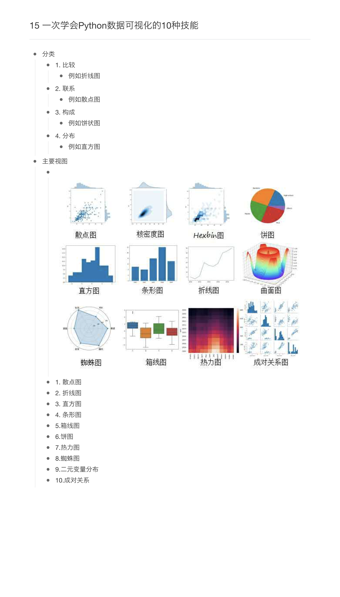
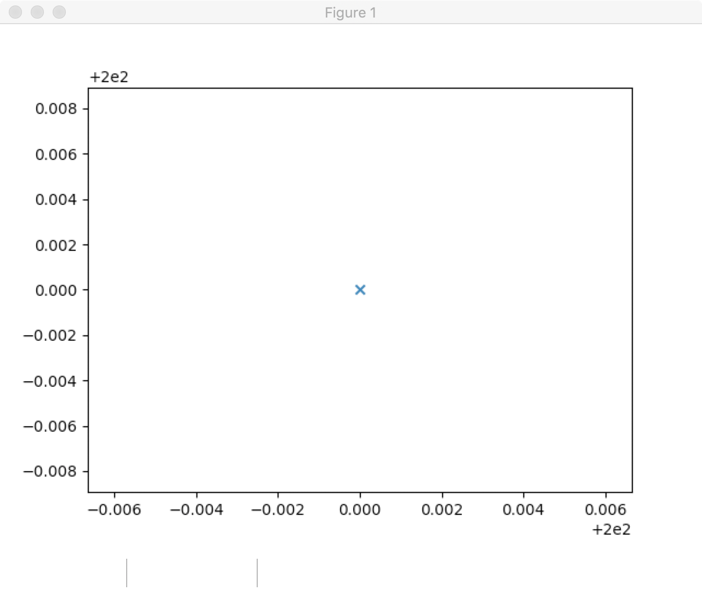
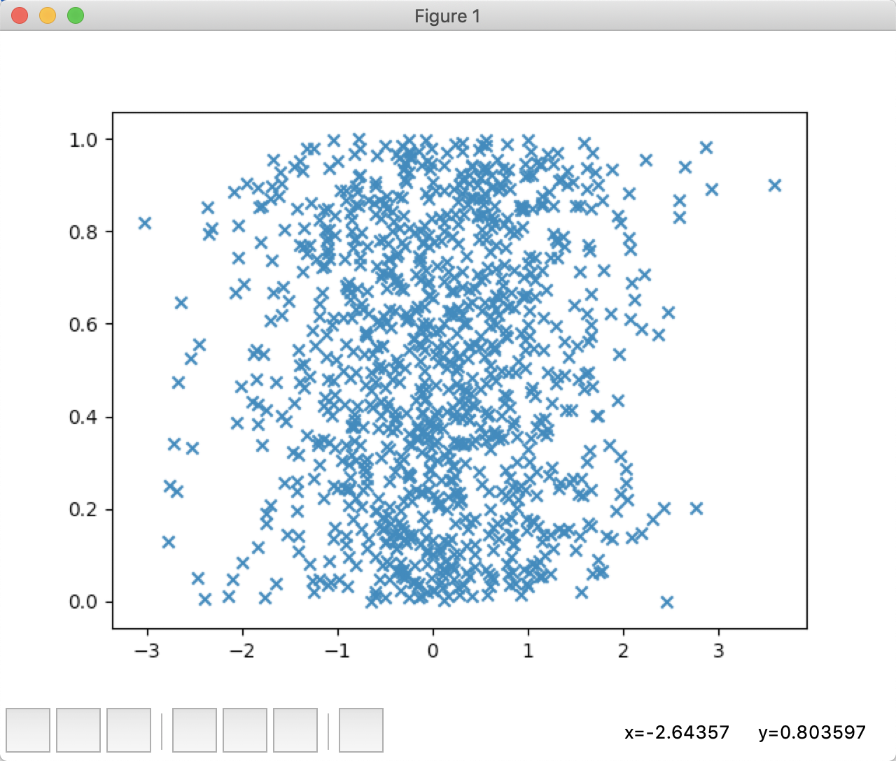
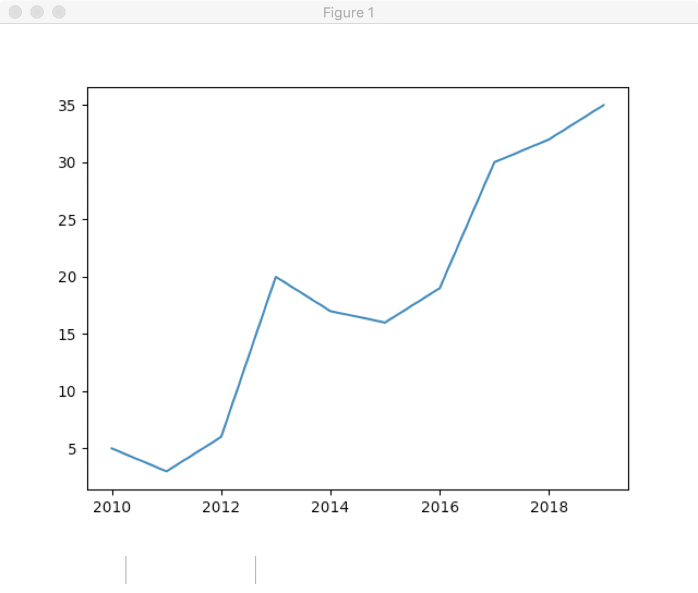
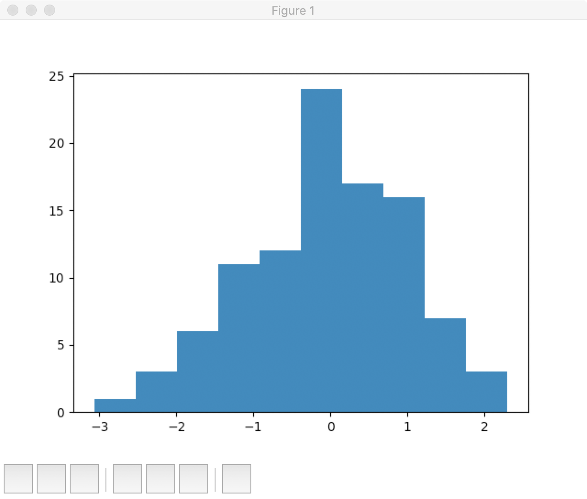
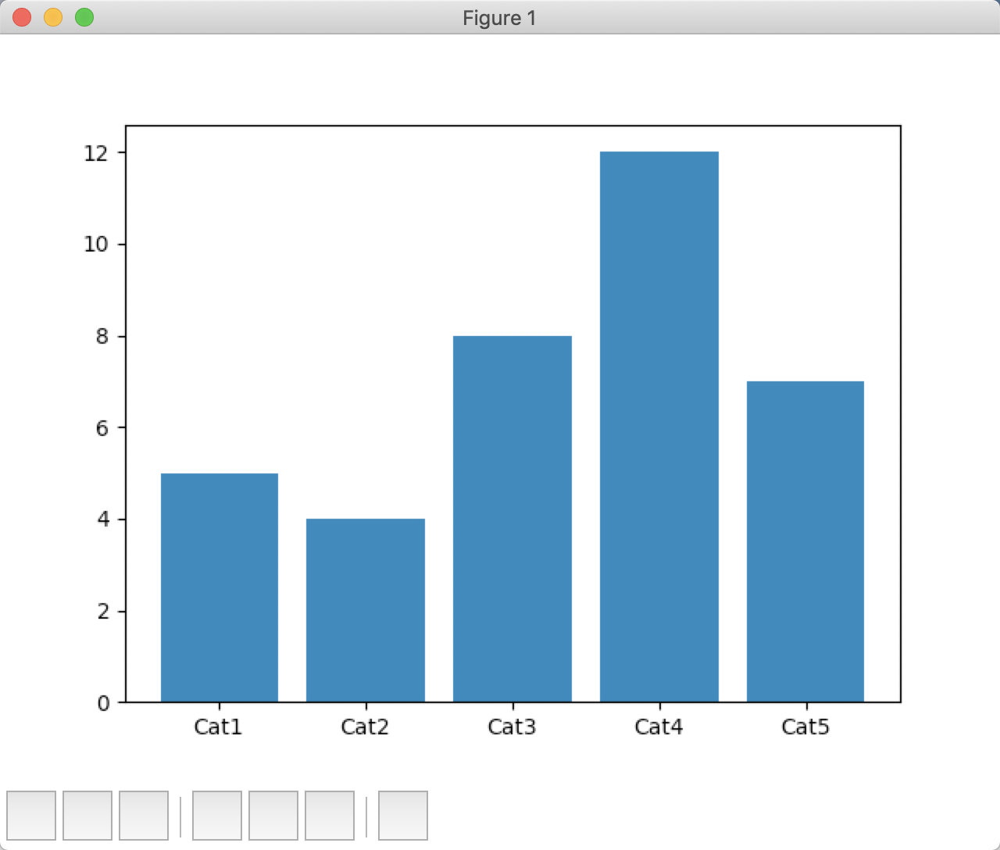
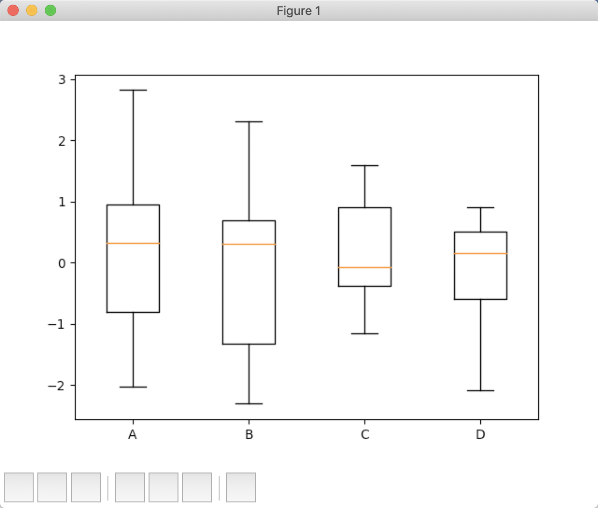
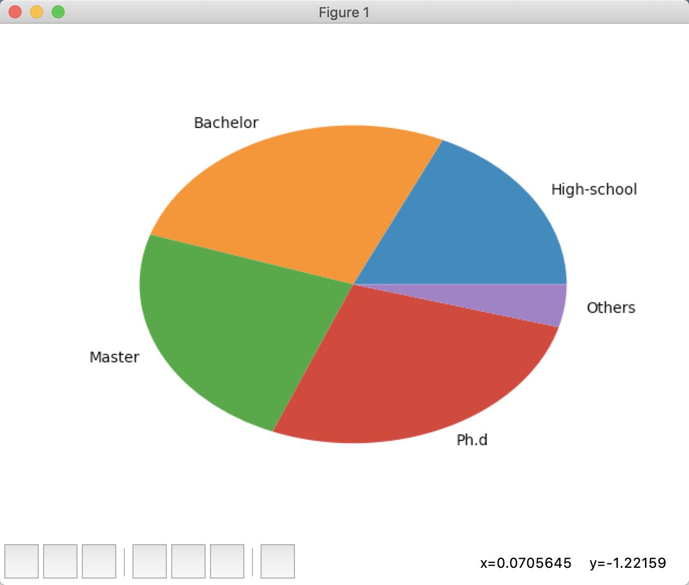

## 一次学会Python数据可视化的10种技能

## 1. 散点图

1、使用局部点渲染 散点图

[代码](./ScatterPlot.py)

## 2、使用随机点生成散点图

[代码](./useseaborn.py)

## 3. 折线图

[代码](./lineChart.py)

## 4.  直方图

[代码](./histogram.py)

## 5. 条形图

[代码](./diagram.py)

## 6. 箱线图

[代码](./diagram.py)

## 7.  饼图

[代码](./pie.py)

## 8.  热力图

[代码](./none.py)

## 9. 热力图

[代码](./pie.py)

## 10. 蜘蛛图

[代码](./spider.py)

