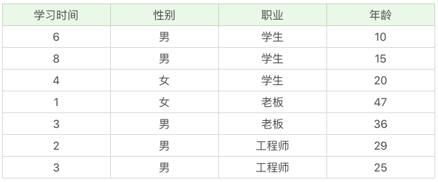
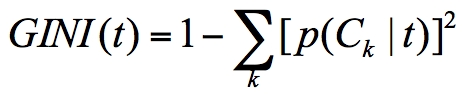

## 分类回归树

- CART算法只支持二叉树
  1. 可以作为分类树
  2. 可以作为回归树

- 分类树可以处理离散数据

### 测试数据

### 基尼系数

1. 反应样本的不确定性
2. 经济学中 基尼系数大于0.4的时候 说明财富差异悬殊 基尼系数在0.2-0.4之间 分类合理
3. 基尼系数越小 样本之间的差异性小 不确定程度低
4. CARTS算法构造分类树的时候 选择基尼系数最小的属性作为属性的划分

### 实例

假设t为节点 该节点的GINI系数的计算公式为

