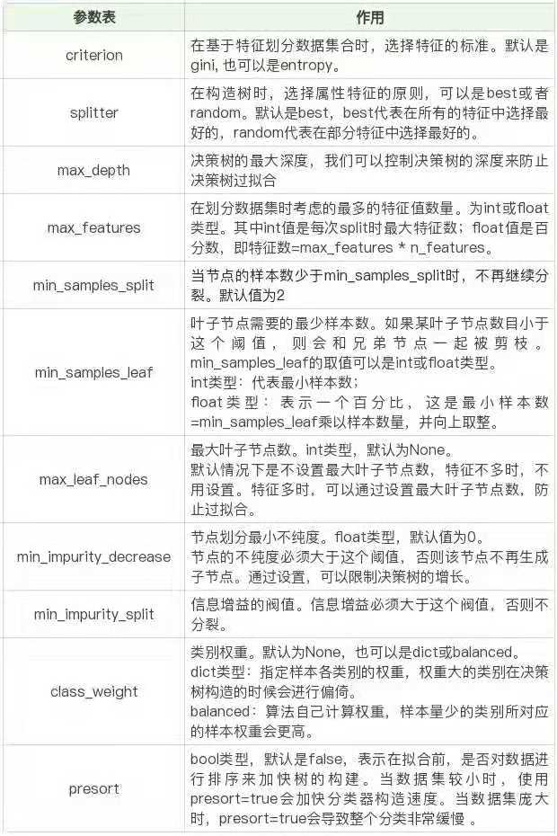
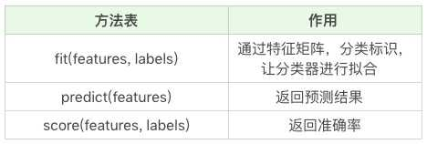

## 泰坦尼克号逃生预测

`sklearn` 自带的决策树模型

## 分类器

```python
clf = DecisionTreeClassifier(criterion='entropy')

```
## 参数列表



## 分类器方法

- 使用 `fit` 方法 数据拟合
- 使用 `predict` 方法 数据预测
- 使用 `score` 方法 得到准确率

表格：



- [模型1代码](module1.py)
- [模型2代码](module2.py)
- [模型3代码](module3.py)
- [模型4代码](module4.py)
- [模型5代码](module5.py)
- [模型6代码](module6.py)
