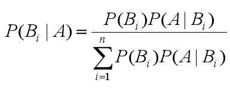
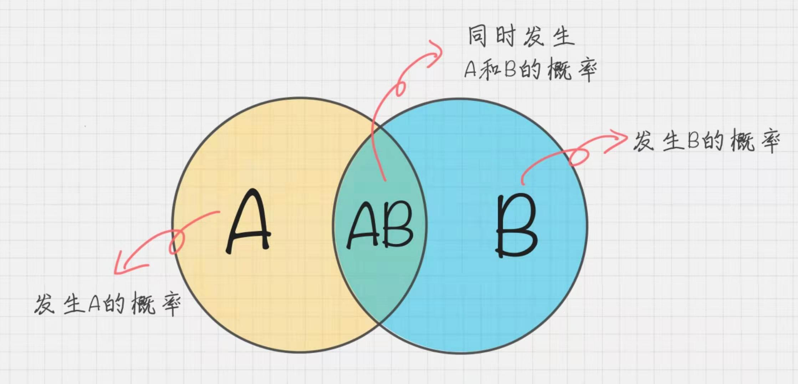
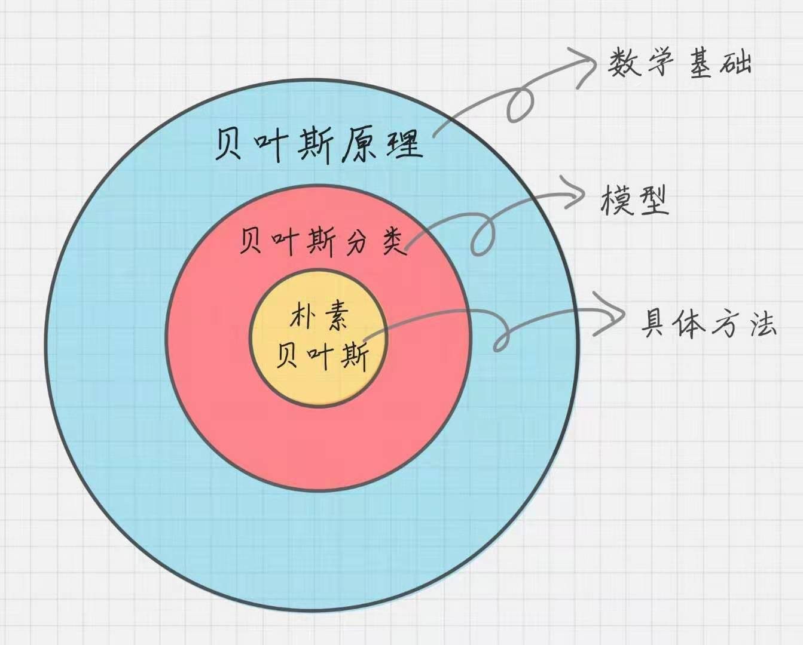
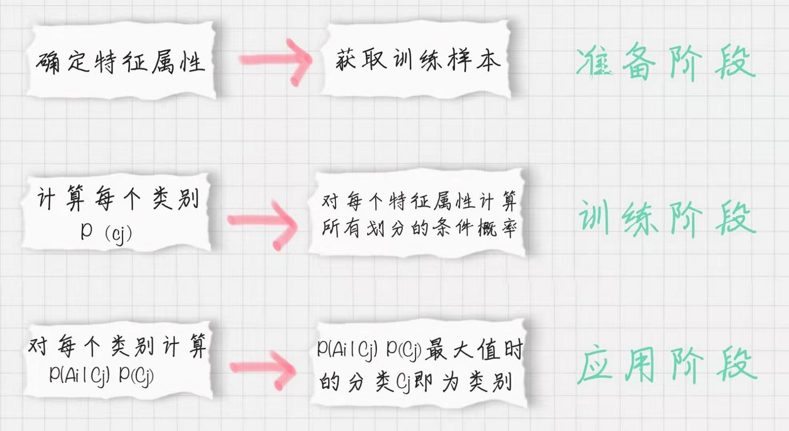

# 概念
## 先验概率

通过经验来判断事情发生的概率

## 后验概率

发生结果之后 推测原因的概率

## 条件概率

事件 `A` 在另一个事件 `B` 已经发生条件下的发生概率 表示为 `P(A|B)`

## 似然函数
把概率模型的训练过程理解为求参数估计的过程

## 贝叶斯公式为：

# 朴素贝叶斯

> 它是一种简单但是几位强大的预测建模算法

## 模型
1. 每个类别的概率 `P(Cj)`
2. 每个属性的条件概率 `P(Ai|Cj)`

## 训练模型

### 贝叶斯原理 贝叶斯分类 朴素贝叶斯之间的区别

## 朴素贝叶斯分类器工作原理

