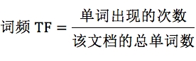
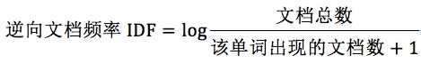
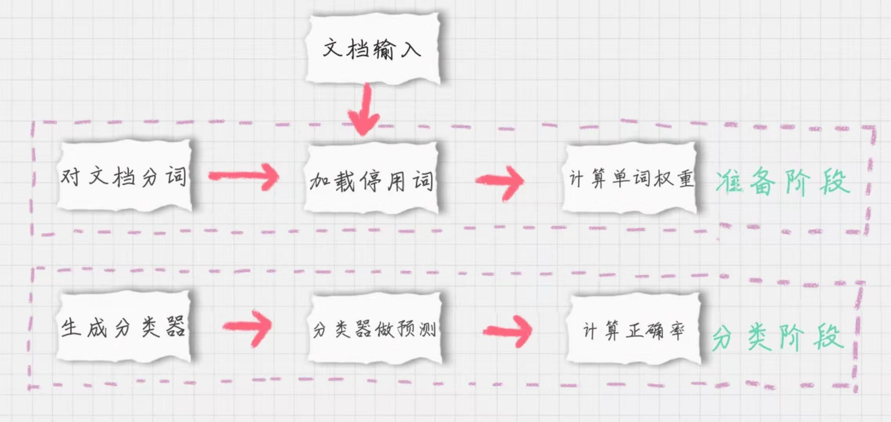

## sklearn 包

- 三个方法
  - 高斯朴素贝叶斯
   - 适应于 特征变量是连续变量 负荷高斯分布 例如身高
  - 多项式朴素贝叶斯
   - 适应于 特征变量是离散变量 例如单词出现的概率
  - 伯努利朴素贝叶斯
   - 适应于 特征变量是布尔变量 例如单词是否出现

## TF-IDF
- 词频
  - 单词在文档中的次数
- 逆向文档频率
  - 单词在文档中的区分度

### 计算方法

- TF


- IDF




```公式
TF-IDF = TF * IDF
```

## 示例代码

[示例代码](./demo.py)
```python
# coding=utf-8
from sklearn.feature_extraction.text import TfidfVectorizer
tfidf_vec = TfidfVectorizer()

documents = [
    'this is the bayes document',
    'this is the second second document',
    'and the third one',
    'is this the document'
]
tfidf_matrix = tfidf_vec.fit_transform(documents)

print('不重复的词:', tfidf_vec.get_feature_names())

print('每个单词的 ID:', tfidf_vec.vocabulary_)


print('每个单词的 tfidf 值:', tfidf_matrix.toarray())

```

## 文档分类



- 英文分类
  - `nltk`
- 中文分类
  - `jieba`
