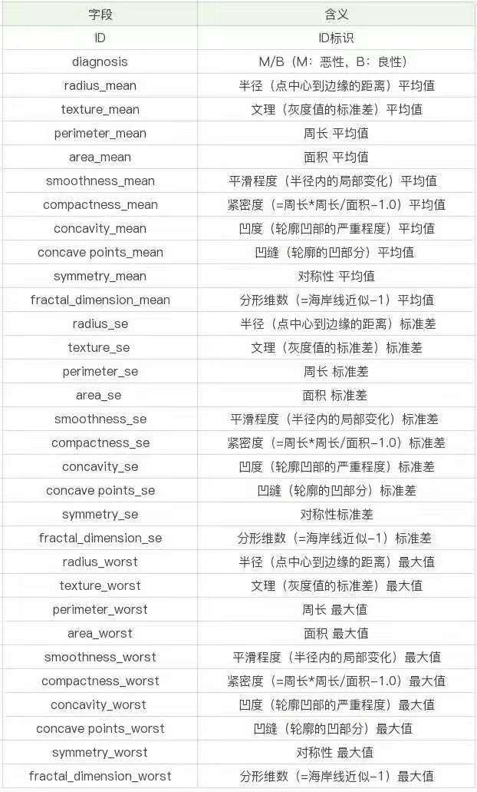
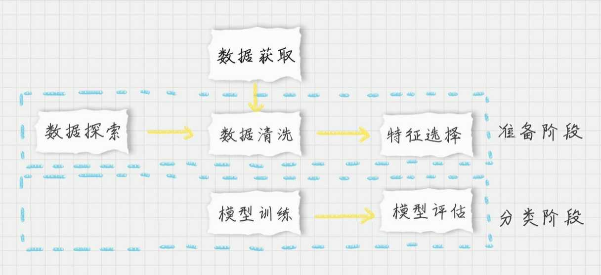

## 如何进行乳腺癌检测

### 如何使用 `SVM`
1. `SVM` 可以做回归
  - 使用 `SVR`
2. 也可以做分类器
  - 使用 `SVC` -- 非线性      
  - 或者 `LinearSVC` -- 线性分类器

## 实例

> 乳腺癌诊断数据集在本讲的根目录

### 肿瘤可以分为良性和恶性

### 数据表共32个字段

### 分类器执行流程

### 代码
- 探索

  [数据探索代码](./discover.py)

- 清洗

  `id` 没有实际含义  去掉

  `diagnosis` 取值 为  `B || M` 替换为 `0 || 1`

  `mean` `se` `worst` 代表不同的度量方式

  [数据清洗代码](./breastCancerData/breast_svm.py)
