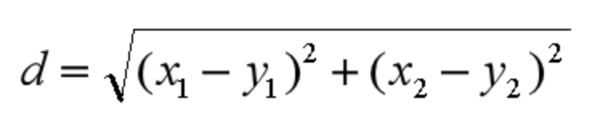
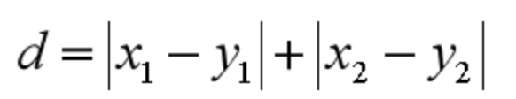
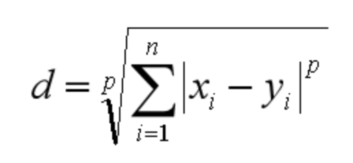

## KNN 工作原理

近朱者赤近墨者黑

### 计算步骤

1. 计算待分类物与他物之间的距离
2. 统计距离最近的K个邻居  
3. 对于K个最近的邻居 那个最多 待分类物属于谁

### 如何选择 `K` 值
1. 工程上 我么你使用交叉验证的思路进行验证
  - 大部分样本作为训练集
  - 剩余部分用于预测
  - 一般的 我们把 `K` 值选取在较小的范围
  - 验证集上准确率最高的一个作为最终 `K` 值

### 距离如何计算

> 距离和差异性成正比

距离计算的方式

1. 欧氏距离

2. 曼哈顿距离


3. 闵可夫斯基距离


4. 切比雪夫距离

```
max(|x1-y1|,|x2-y2|)
```
5. 余弦距离

  - 计算两个向量的夹角

> 前三种常用

### `KD` 树

概念

`KD` 树是对数据点在K维空间中划分的一种数据结构
 - 每个节点都是k维数值点的二叉树


## `KNN` 回归

1. 找到这个点的 `K` 个最近邻居 然后将这些邻居的属性的平均值赋值给该点 可以得到该点的属性
