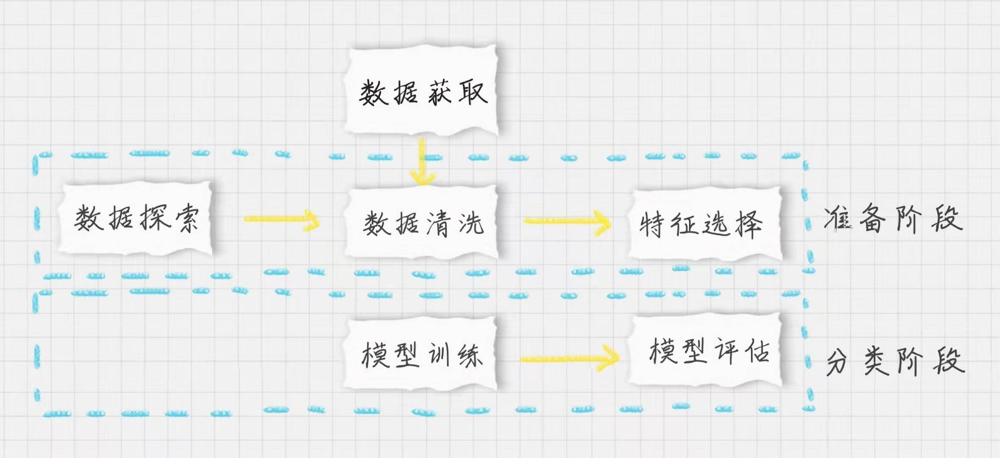
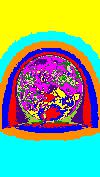

## 切割微信启动图 默认
>  切割图像流程和分类差不多:

 [切割图片源码](./kmeans-master/kmeans1.py)

切割之后图片预览：

## 切割成为16部分 染色
 [切割16份图片源码](./kmeans-master/kmeans2.py)

预览：

## 聚类可视化还原为质心点
[还原](./kmeans-master/kmeans3.py)

预览：

