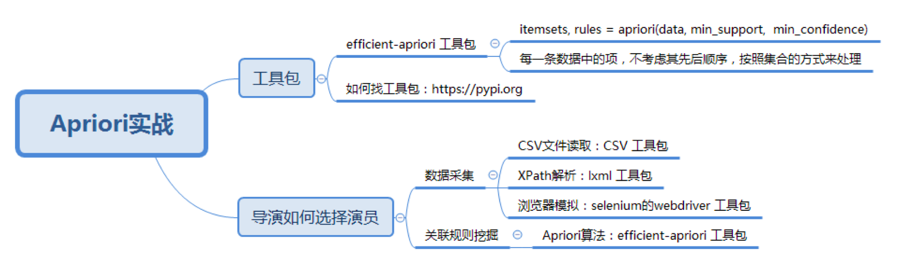

## 使用工具 

```python
itemsets, rules = apriori(data, min_support,  min_confidence)

```

- data 
  - 数据集
- list 
  - 数组
- min_support
  - 最小支持度
  

## 挖掘频繁集和规则 ` demo ` 上一讲的超市案例

[代码](demo1.py)

## 导演挖掘演员

流程

1. https://movie.douban.com/
2. 输入 名称
3.  [抓取数据代码](demo2.py)
4. [挖掘](demo3.py)
5. 总结



 