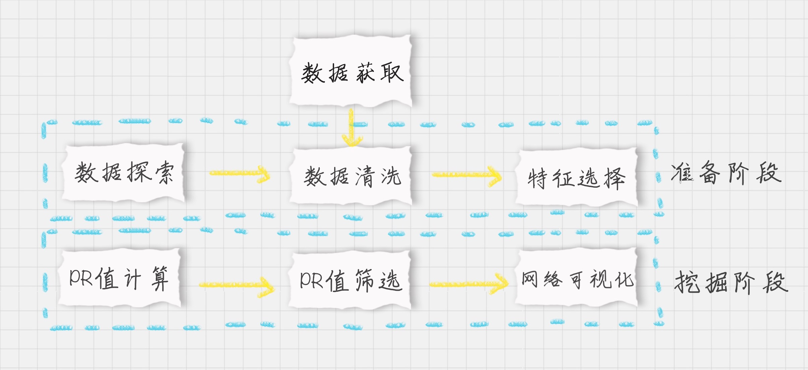
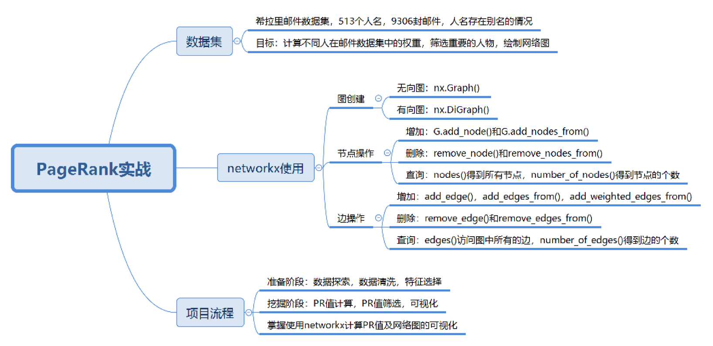

## 思考
1.  如何使用工具完成 PageRank 算法
2.  如何挖掘有影响力的节点 并绘制网格图
3. 如何对可视化已创建的网络图

## 如何使用工具实现PageRank算法
 - 工具
  - NetworkX(内置常用图与网络分析算法) 方便网络数据分析
  - 计算上一讲的ABCD四个网页的PR
    - 代码: [点我](./demo1.py)

  
1. 关于图的创建
  
  - 图
    - 无向图
      - 不用节点之间边的方向
      - nx.Graph()

    - 有向图
      - 节点之间的边是有方向的
      - nx.DiGraph() 
      
2. 节点的增删查

添加

```python

# 单点
G.add_node('A')
# 点集合
G.add_nodes_from(['B','C','D',...

```
删除
```python
G.remove_node(node)

```

查询
```python
# 所有
G.remove_node(node)

# 查询节点个数
G.number_of_nodes()

```

3. 关于边的增删查

```python
# 增加边 
G.add_edge('A', 'B')
G.add_edges_from()
G.add_weighted_edges_from()

# 删除
G.remove_edge()
G.remove_edges_from()

# 查询
G.edges()
G.number_of_edges()

```
## PageRank 揭秘希拉里邮件人物关系

流程步骤图：



官方源码

[官方源码](./PageRank/email_pr.py)

修改后

[修改后源码](./demo2.py)


### 总结



