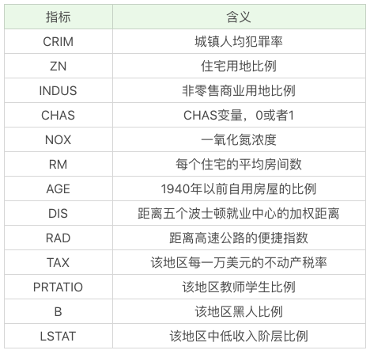
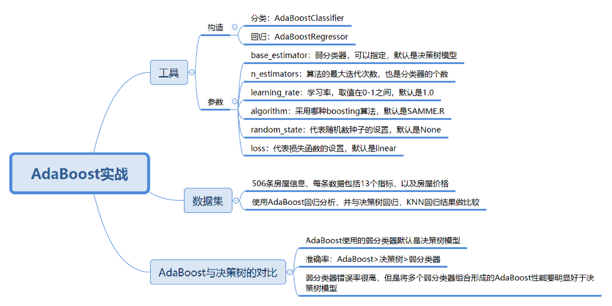

## 分类 和 回归

- 本质：对事物做预测
- 不同： 输出的结果类型
  - 分类
    - 离散值
  - 回归
    - 连续值
 
 ## 1. 使用 `AdaBoost` 工具
 
 ```python
from sklearn.ensemble import AdaBoostClassifier

```

## 放假预测

我们看下 `sklearn` 中自带的波士顿房价数据集。

13项指标




## 运算过程

1. 加载数据

2. 分隔数据为训练集和测试集

3. 创建 `AdaBoost` 回归模型

4. 传入训练集数据进行拟合

5. 传入测试数据集进行预测


### 代码

  [示例代码](demo1.py)
  
## 使用决策树和回归树

   [示例代码](demo2.py)
   
## AdaBoost 与决策树模型的比较

   [官方代码](demo3.py)
   
   [pipenv 代码](demo3-1.py)
   
## 总结


   