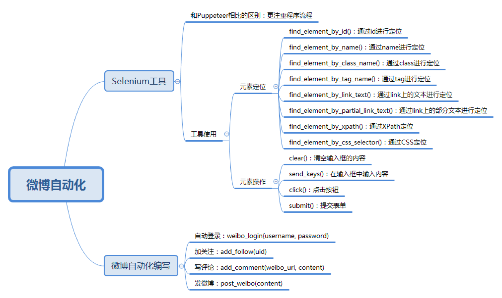

## Python 自动化运营微博


### Selenium 自动化测试工具
#### 定位元素
1. 通过 `id` 定位

```python
find_element_by_id()

```

2. 通过 name 定位

```python
find_element_by_name()

```

3.通过 `class` 定位

```python
find_element_by_class_name()

```

4. 通过 tag 定位

```python
find_element_by_tag_name()

```
5. 通过 `link` 完整文本定位

```python
find_element_by_link_text()

```

6.  通过 `link` 部分文本定位

```python
find_element_by_partial_link_text()

```

7. 通过 xpath 定位

```python
find_element_by_xpath()
```
8. 通过 css 定位

```python
find_element_by_css_selector()
```

#### 对元素进行操作

1. 清空输入框的内容

```python
clear()
```

2. 在输入框中输入内容

```python
send_keys(content)
```
3. 点击按钮

```python
click()
```

4. 提交表单

```python
submit()
```

## 加关注 写评论 发微博

[实例代码](weibo.py)

### 如何获取UID

点击任何一个微博用户
u 后面的数字就是用户的UID
```
https://weibo.com/u/5020181423...

```

大 V 分类  点击他的粉丝即可查看 UID
```
https://weibo.com/1890826225/f...

```

### 如何使用Xpath 获取路径

使用 chrome 调试工具 检查


### 总结


