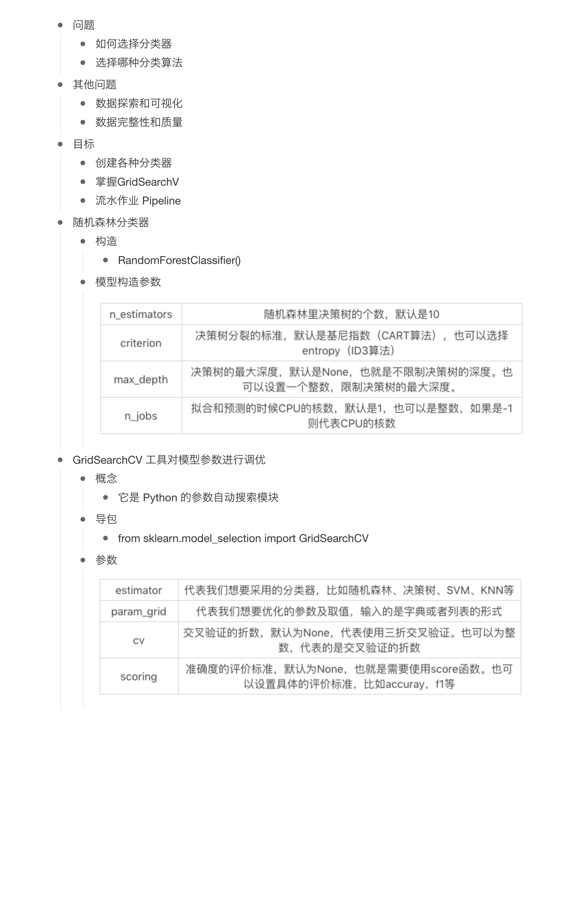

## 39讲

## 随机森林算法 `demo`

[代码实例](demo.py)

## `Pipeline` 管道机制流水线作业

分类步骤

 1. 数据规范化处理
   - `StandardScaler()` 方法
 2. `PCA` 方法 对数据降维
  
 3. 分类器分类
 
 
 [代码实例](demo2.py)
 
 采用 Pipeline 管道机制，用随机森林对 IRIS 数...

 [代码](demo3.py)

## 对信用卡违约率进行分析

数据集字段

构建分类器

  1. 加载数据
  2.  准备阶段
      - train_test_split 划分数据集
  3. 分类阶段
     - 管道机制
     - 数据规范
     - 分类
 
实战

 [官方代码](./credit_default/credit_default_analysis.py)
 
 [demo4](demo4.py)
 
 ## 总结
 
 
 