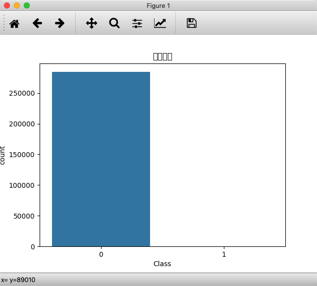
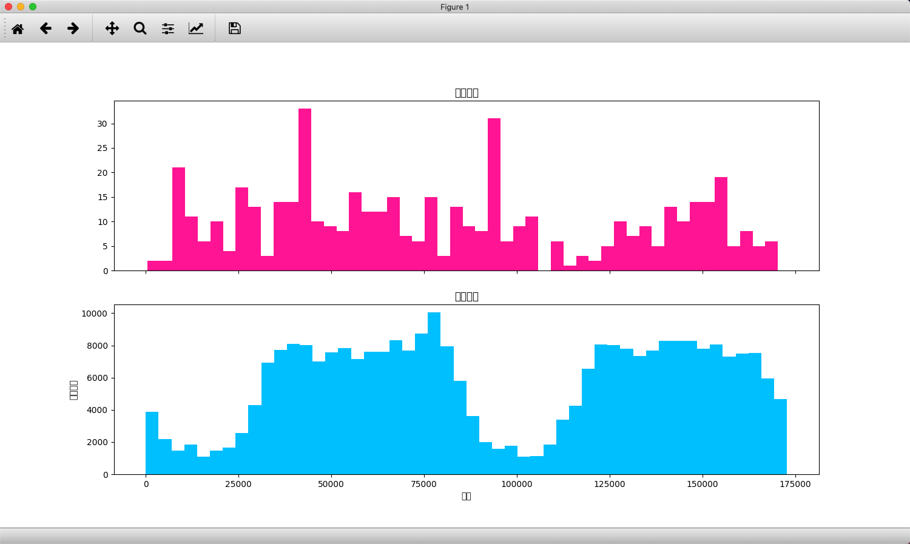
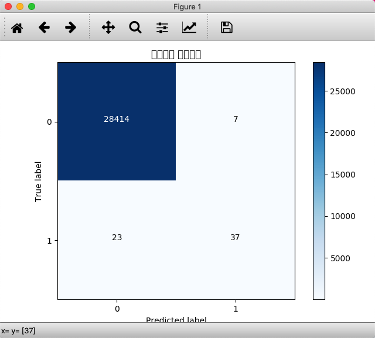
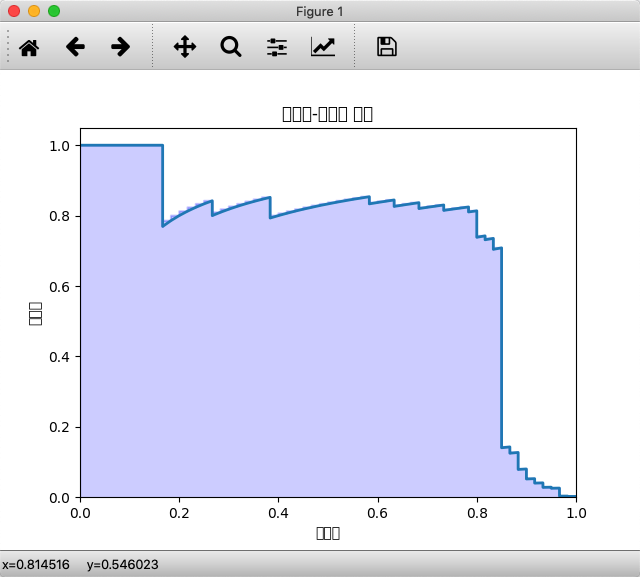

## 信用卡诈骗分析

问题

 1. 比例更小
 2. 危害更大

## 掌握

1.  逻辑回归分类
2. 二分类问题，什么模型评估更准确
3. 实战项目

## 构建逻辑回归分类器

1. 概念

逻辑回归

`logistic` 回归,它实际上是分类方法，为了解决二分类问题。也可解决多分类问题

2. 函数公式


函数图形


- `z` 越大的时候，`g(z)` 越大，当 `z` 趋近于无穷大的时候，`g(z)` 趋近于 `1`

- `z` 趋近于无穷小的时候，`g(z)` 趋近于 0

- 函数值以 `0.5` 为中心

- `0` 即为不发生，`1` 即为发生

## 代码实现 `sklearn`


LogisticRegression()

参数：

- `penalty`：惩罚项，取值为 l1 或 l2，默认为 l2...
- `solver`：代表的是逻辑回归损失函数的优化方法
- `max_iter`：算法收敛的最大迭代次数
- `n_jobs`：拟合和预测的时候 CPU 的核数，默认是 1

模型评估指标

评估模型的好坏

F1


F1 作为精确率 P 和召回率 R 的调和平均

数值越大代表模型的结果越好

分析步骤


总量



诈骗交易 && 正常交易



```
总交易笔数:  284807
诈骗交易笔数： 492
诈骗交易比例：0.001727
```

 逻辑回归 混淆矩阵



 精准率 召回率



## 说明

混淆矩阵

混淆矩阵也叫误差矩阵，实际上它就是 TP、FP、TN、FN 这四个数值的矩阵表示


`precision_recall_curve` 函数，预测值和真实值来计算精确率 - 召回率曲线

`precision_recall_curve` 函数会计算在不同概率阈值情况下的精确率和召回率


## 总结


