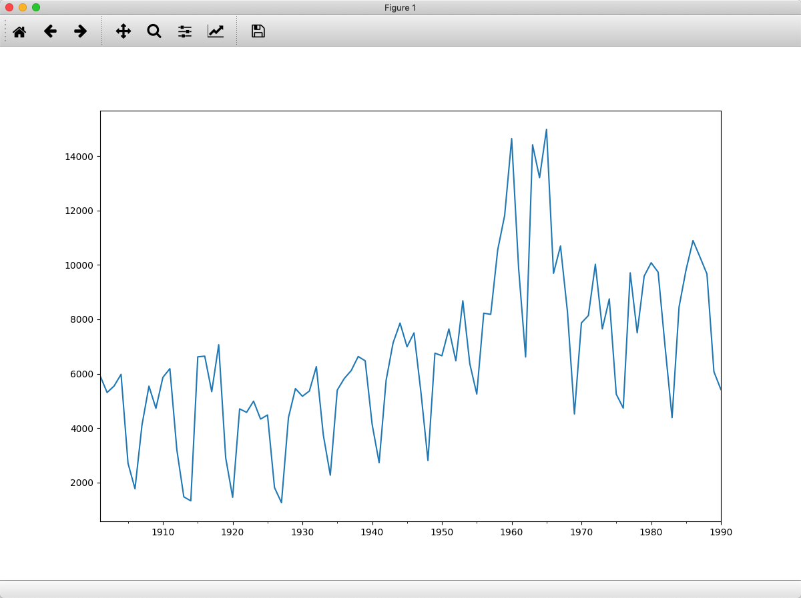
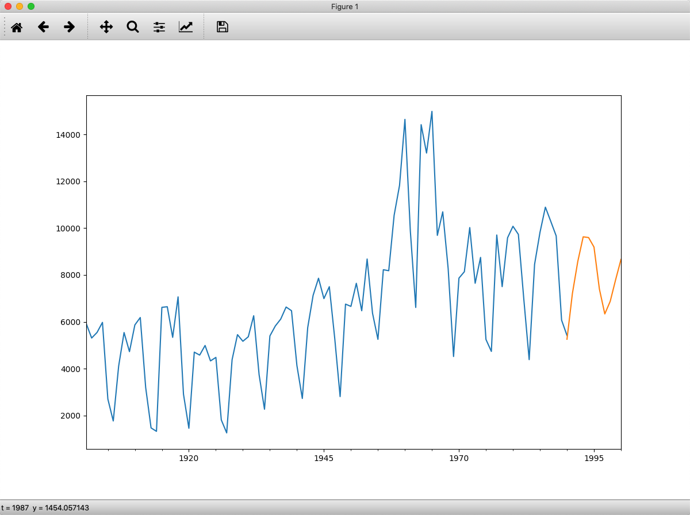
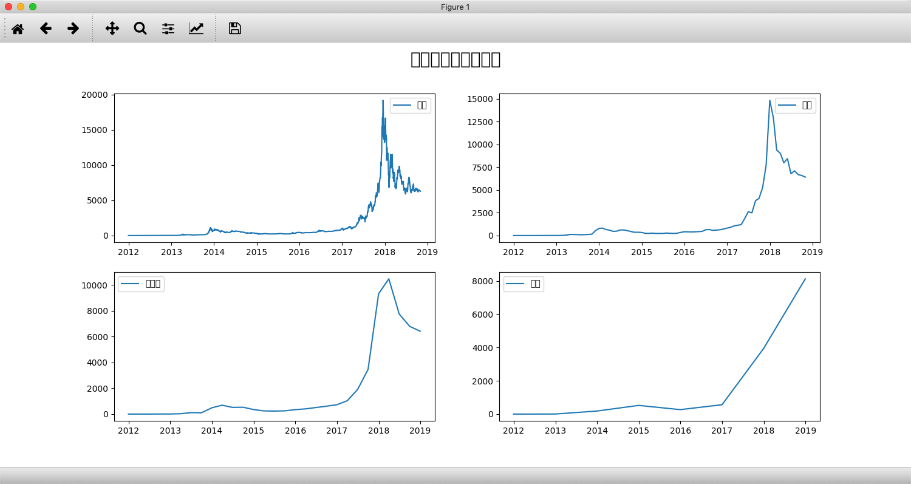

## 问题

比特币走势预测 那个方法比较好呢
  - 分类
  - 聚类
  - 回归
  - 关联分析

## 时间序列分析算法

时间序列分析模型建立了观察结果与时间变化的关系
可以帮助我们预测未来一段时间内的结果变化

## 时间序列和回归分析有哪些区别

1. 确定结果和变量之间的关系
2. 时间序列分析得到的是目标变量 `y` 与时间的相关性
3. 回归分析训练得到的是目标变量y 与 字段量 x( >=1 个) 的关联性  

4. 回归擅长的是多变量和目标结果之间的分析
5.时间序列分析建立在时间变化的基础上
    - 趋势
    - 周期
    - 时期
    - 不稳定因素


## 掌握

1. 概念
2. ARMA模型工具
3. 比特币历史数据时间序列建模并预测未来6个月的走势

经典模型

  - AR Auto Regressive 自回归模型
  - MA
  - ARMA
  - ARIMA

思想

过去若干时刻的点通过线性组合 加上白噪声 即可预测未来某个时刻的点

白噪声

  - 一个期望值为 `0` 方差为常数的纯随机过程

### 概念分类

- `AR` 模型还存在一个阶数，称为 `AR（p`）模型, `p` 阶自回归模型, 指定时刻 前 p 个点 通过线性组合加上白噪声来预测 `current` 的值

- `  MA` 滑动平均模型 历史时序值的线性组合， MA 是通过历史白噪声进行线性组合来影响当前时刻点

- ` ARMA` 是 `AR` 模型和 `MA` 模型的混合 同样 `ARMA` 模型存在 `p` 和 `q` 两个阶数，称为 `ARMA(p,q)` 模型

- `ARIMA`  差分自回归滑动平均模型 、 求合自回归滑动平均模型

相比于 `ARMA`，`ARIMA `多了一个差分的过程 不平稳数据进行差分平稳
平稳后建模

- `ARIMA` 是一个三元组的阶数 `(p,d,q)`，`ARIMA(p,d,q)` 模型 `d` 是差分阶数


引入

```python
from statsmodels.tsa.arima_model import ARMA
```
代码实例

1. [测试](demo.py)

2. 结果对比


预测走势


```python
AIC: 1619.6323
```
字段


流程


数据按月压缩

```python
df_month = df.resample('M').mean()
```

## 代码实例

比特币金额


打印日志

```python
最优模型:                                ARMA Model Results
==============================================================================
Dep. Variable:         Weighted_Price   No. Observations:                   83
Model:                     ARMA(1, 1)   Log Likelihood                -688.761
Method:                       css-mle   S.D. of innovations            957.761
Date:                Mon, 18 Mar 2019   AIC                           1385.523
Time:                        12:35:34   BIC                           1395.198
Sample:                    12-31-2011   HQIC                          1389.410
                         - 10-31-2018
========================================================================================
                           coef    std err          z      P>|z|      [0.025      0.975]
----------------------------------------------------------------------------------------
const                 2133.3881   1571.958      1.357      0.179    -947.592    5214.368
ar.L1.Weighted_Price     0.9252      0.042     22.031      0.000       0.843       1.008
ma.L1.Weighted_Price     0.2680      0.116      2.310      0.023       0.041       0.495
                                    Roots
=============================================================================
                  Real          Imaginary           Modulus         Frequency
-----------------------------------------------------------------------------
AR.1            1.0808           +0.0000j            1.0808            0.0000
MA.1           -3.7313           +0.0000j            3.7313            0.5000
```
实际金额 预测金额

## 总结


