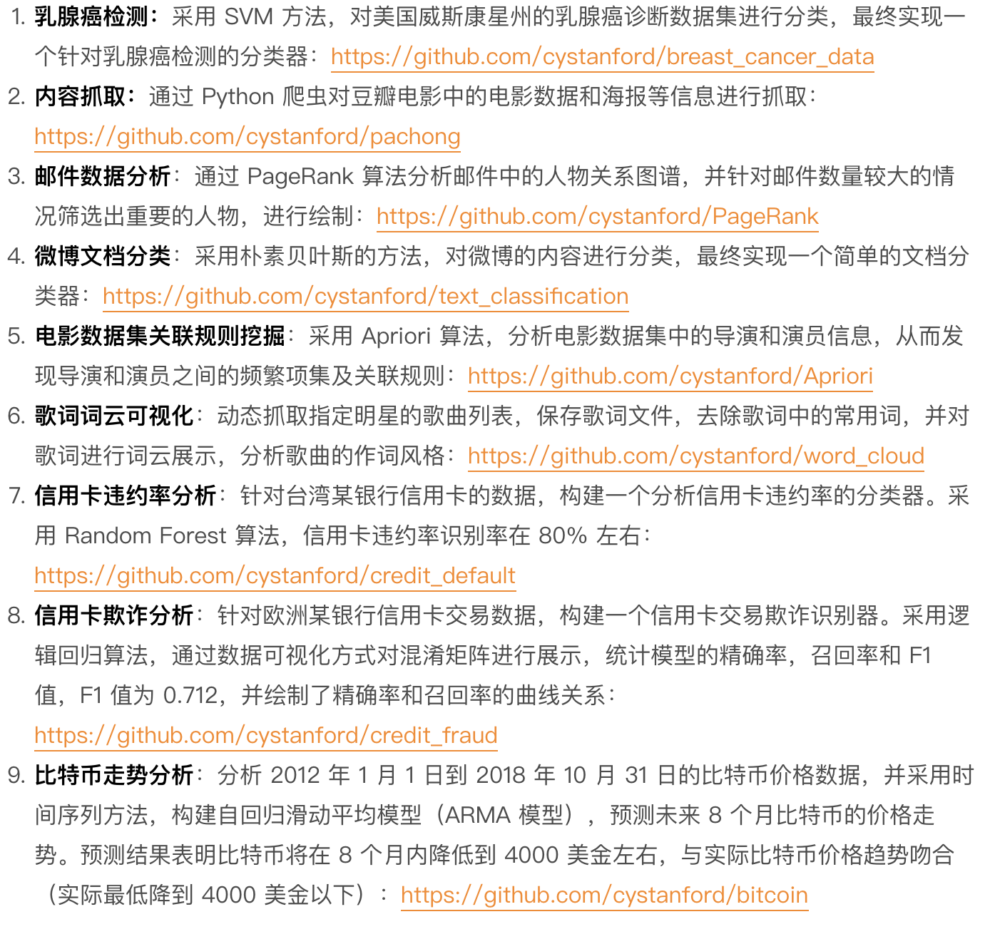

## 求职攻略

注意事项

1. `HR` 看项目经验的逻辑是什么
2. 明确目标 如何快速定位要积累的内容
3. 如何在项目经验上融入自己的体会

## `HR` 看简历的背后逻辑

1. 项目经理相当于一种训练
2. 训练的更好之后 模型分析能力越强
3. 如果没有相关经验 那你找的这份工作就好比是练手的训练集
4. `HR` 期望你是已经训练好的模型 能够立即展开工作 并产生价值

### 项目经理那里来？

1. 工作经历
2. 类似项目
3. 简历不是流水账
4. 项目目标 解决方案 实现代码 项目过程的总体会

## 完善项目简历

1. 练习的github 项目
2. 根本：自己跑一遍项目 了解项目目标和解决方案
3. 例如
  

## 心得体会

总之自己的心得体会和总结能给项目经验加分不少。

## 总结

