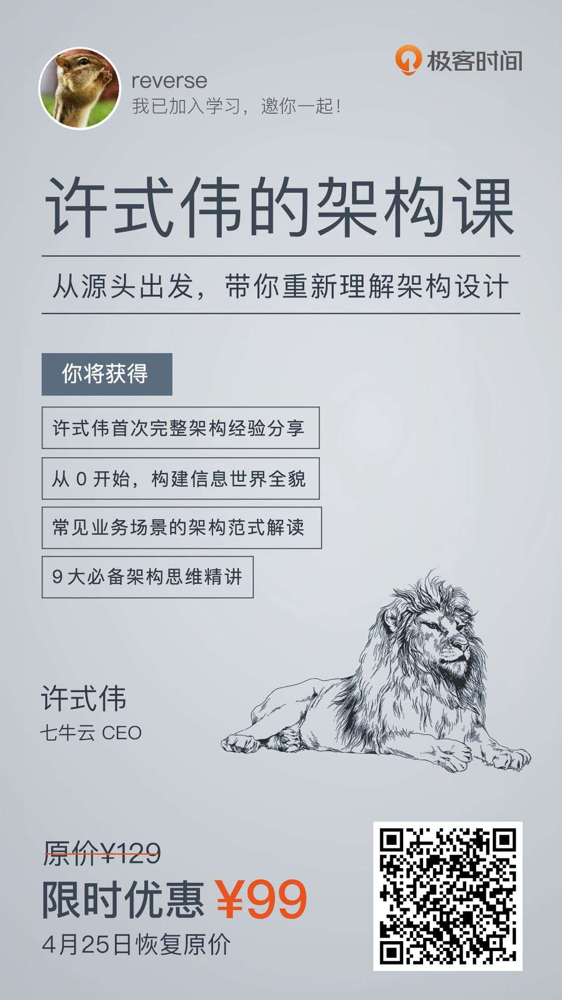
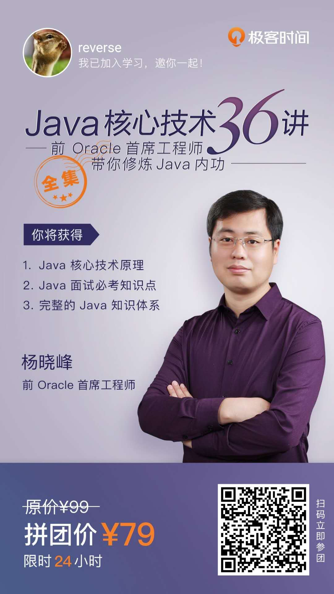
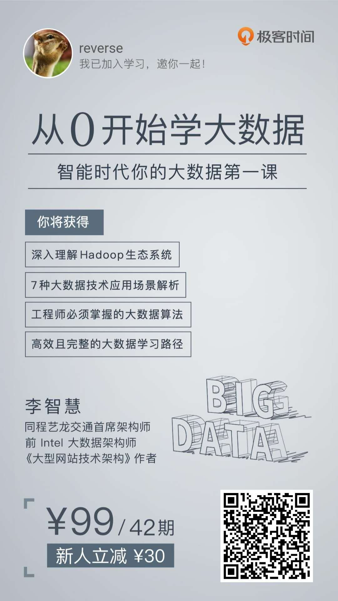
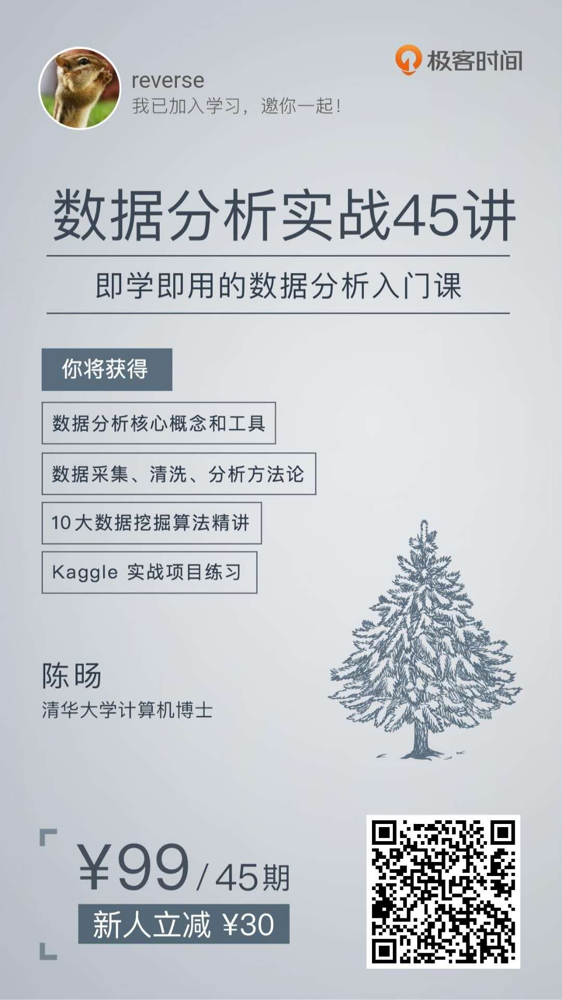
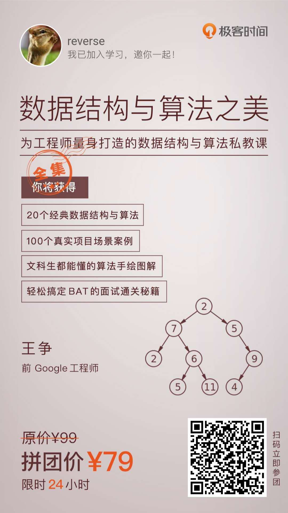
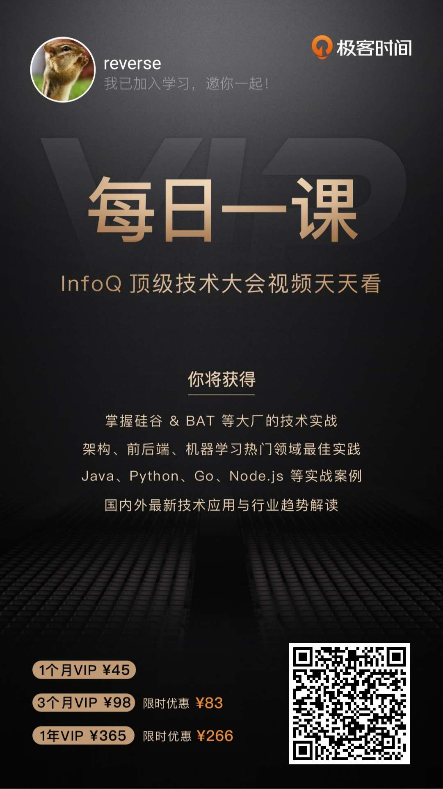
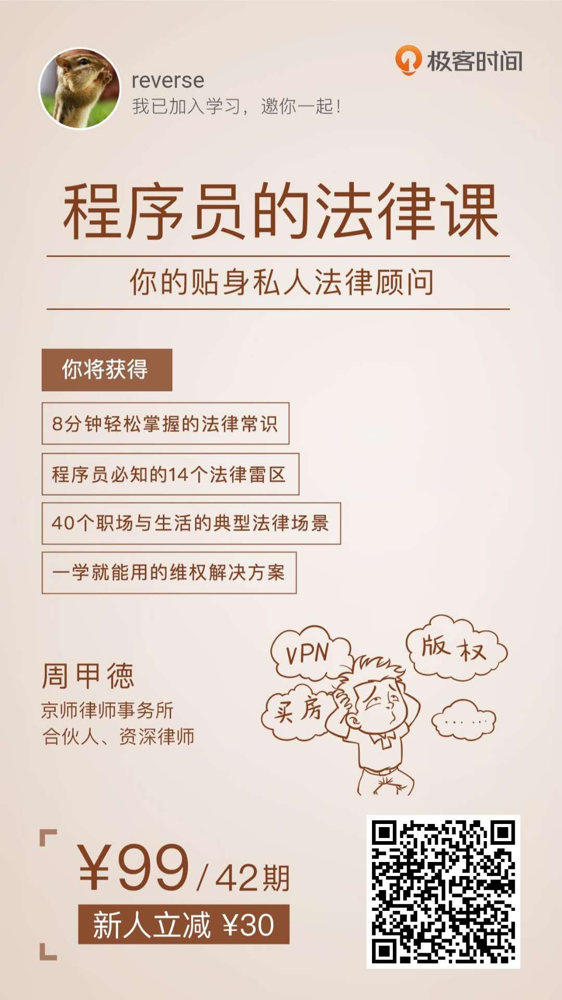
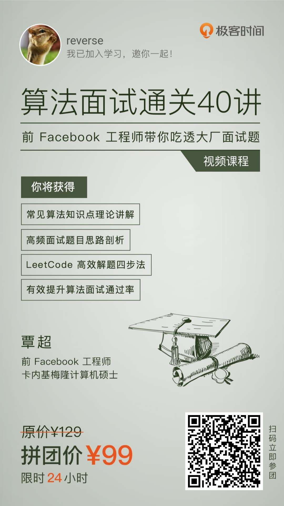

## 如何循序渐进的学习基础知识和硬技能？

古语云： 

 大音希声 大象无形 大道至简 
 
 > 《道德经》
 
 
就算你学了很多框架 但万变不离其宗，学到真正的基础知识和方法才是最有价值的

想要打通您的技术任督二脉？请看⬇️

下面是我购买的课程，你可以从里面挑选你喜欢的课程，也可以参照我的过程进行学习

通过我分享的二维码 ，你可以用优惠价拿到你满意的课程，这是一个互惠互利 的过程

## 七牛云CEO(许式伟)架构课

> 从源头出发，带你重新理解架构设计

## Java核心技术36讲

> `Java` 的核心知识分析，适合 `Java` 技术栈的童鞋

## 从0开始学大数据

> 大数据处理的入门课程

## 从0开始学架构

> 架构的总要性不言而喻

## 左耳朵耗子专栏

> 洞悉技术的本质 享受技术带来的乐趣

## 数据分析45讲

> 重点： 本项目的笔记来源，喜欢数据分析和深度学习吗？ 那就快去买吧

## 数据结构与算法之美

> 数据结构和算法 统一分析 适合系统学习

## 每日一课

> 不必进大厂 也能一年之内获得别人三年才能学到的知识

## 程序员的法律课

> 法律是最好的武器 脆弱的程序员需要保护

## 算法面试通关45讲

> 前 `FaceBook` 员工 覃超 带你深度学习算法知识 打通你的任督二脉

